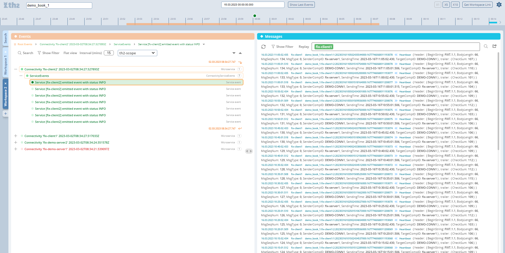

# Report-viewer


This is a web app that displays the stored test data (events and messages) using `report-data-provider`. 
Major versions of report-viewer and report-data-provider are compatible.

# API
This app needs `report-data-provider 2.0.0 (or newer)` backend component to function. 

# Configuration
To include this component in your schema, a following yml file needs to be created
```
apiVersion: th2.exactpro.com/v1
kind: Th2CoreBox
metadata:
  name: report-data-viewer
spec:
  image-name: ghcr.io/th2-net/th2-rpt-viewer
  image-version: 2.0.18 // change this line if you want to use a newer version
  type: th2-rpt-viewer
  extended-settings:
    chart-cfg:
      ref: schema-stable
      path: custom-component
    service:
      enabled: false
      targetPort: 80
      nodePort: '31276'
    resources:
      limits:
        memory: 15Mi
        cpu: 200m
      requests:
        memory: 10Mi
        cpu: 20m

```


# Screenshots

