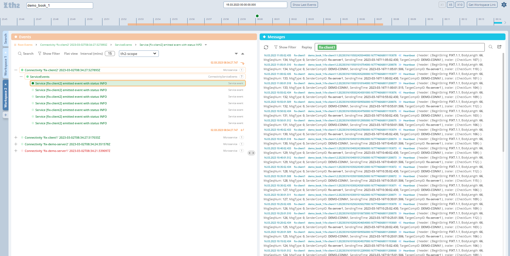

# Report-viewer


This is a web app that displays the stored test data (events and messages) using `report-data-provider`.

# API

This app needs `report-data-provider 5.1.0 (or newer)` backend component to function. It should be accessible at `{rpt-viewer-path}/backend/*`

# Configuration

To include this component in your schema, a following yml file needs to be created

```
apiVersion: th2.exactpro.com/v2
kind: Th2CoreBox
metadata:
  name: rpt-data-viewer
spec:
  imageName: ghcr.io/th2-net/th2-rpt-viewer
  imageVersion: 5.1.19 // change this line if you want to use a newer version
  type: th2-rpt-viewer
  extendedSettings:
    resources:
      limits:
        cpu: 50m
        memory: 50Mi
      requests:
        cpu: 50m
        memory: 50Mi
    service:
      enabled: true
      clusterIP:
      - name: gui
        containerPort: 8080
        port: 8080

```

# Screenshots



# JSONL reader

## API

This functionality needs `th2-json-stream-provider 0.0.7 (or newer)` backend component to function. It should be accessible at `{rpt-viewer-path}/json-stream-provider*`

## Features

- It able to view contents of JSONL files, such files could be loaded from local or from server using  `th2-json-stream-provider`. It will display complex values as tree leafs and simple values of selected leaf would be visible in table. Amount indicator of complex fields will be `{N}` after leaf name and for simple fields it would be in `(N)`. If leaf has field `#display-timestamp` with numeric timestamp value in nanoseconds it would be converted to human readable format and displayed after indicators.
- View type could be changed using 3 dots on the right of the leaf. It has 4 types:
  - Plain JSON in one line;
  - Formated JSON;
  - Tree view;
  - Table, which will display field `#display-table`, which is 2D Array where first array is Header and others is rows, as formated table below leaf;
- View could be changed for whole group via buttons on the right of group name
- Leaf with `#display-timestamp` will be colored depending on current interval which could be changed at the top of view. It has millisecond, second, minute types of interval and any positive numeric value could be entered for them.
- It has search which will highlight searched values in the viewing files. Current search could be exported in the JSON file, and imported from such files. Search files has this structure

```
[{
  "pattern": "searched value",
  "color": "hex color"
}, ...]
```

- JSONL reader can also generate data by Jupyter Notebooks execution using `th2-json-stream-provider`, when notebook is requested it will be displayed as list of parameters which could be modified. Then this notebook could be launched and resulting JSONL file will be requested on finish and added to current list.
- Notebooks has default result of 1 in which case new results will overwrite previous result of this notebook, this could be changed in the bottom of notebook editing form, if amount is more than 1 then result will overwrite oldest one.
- If notebook result had search file with structure stated before, it will replace current search.
- Current parameters value could be saved into JSON file, and reloaded back with such file. Parameters file has this structure:

```
[{
  "name": "parameter name",
  "values": "parameter value"
  "type": "parameter type",
  "isOff": "is parameter was on"
}, ...]
```

- Parameters could be turned off, in which case they will send value `"[NA]"`.

- Current mode could be changed to compare mode. In this mode left panel will also function same way as stated before, and table with selected content will be at the bottom for both panels. But if both panel have leafs with `#display-timestamp` it will display chunks with same height for both panels if there is not enough leafs for such height it will display empty fields with coresponding chunk coloring.